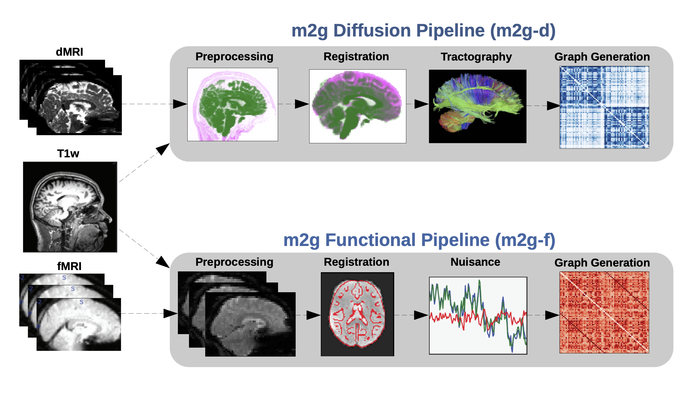
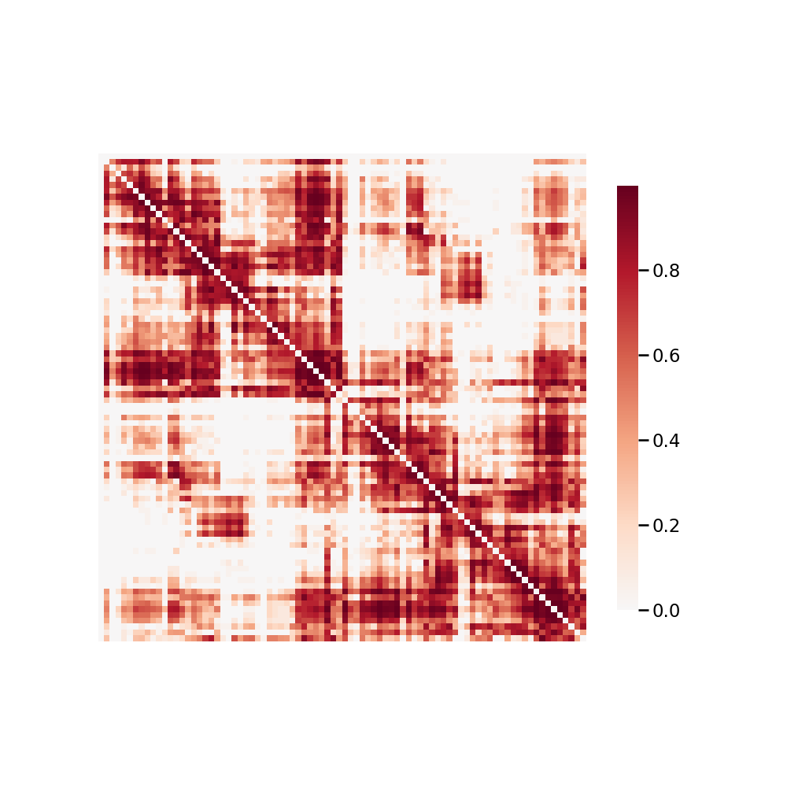

******************
Diffusion Pipeline
******************

.. contents:: Table of Contents

Here we take a deep-dive into the modules of the ``m2g-d`` pipeline. We will explain algorithm and parameter choices that were implemented at each step and the justification for why they were used over alternatives.

Output Summary Table
====================

.. list-table:: ``m2g-d`` **IO Breakdown**. Below, we look at the inputs, outputs, and QA figures produced by ``m2g-d``. See `Pipeline Outputs`_ for more detailed file structure.
    :widths: 10 15 10 5
    :header-rows: 1
    :stub-columns: 0

    * - Step
      - Inputs
      - Outputs
      - QA figures
    * - Preprocessing & Registration
      - raw dMRI, raw T1w, template
      - aligned dMRI
      - Figure S2
    * - Tensor Estimation
      - aligned dMRI
      - tensor field
      - Figure S3
    * - Tractography
      - tensor field
      - fiber tracts
      -
    * - Graph Generation
      - fiber tracts, parcellations
      - connectome
      - Figure S4

Pipeline Summary
=====================================

    Figure 1: The ``m2g-d`` pipeline transforms Nifti-formatted dMRI data into sparse structural connectomes. The ``m2g-d`` pipeline consists of 4 main steps: 1) preprocessing & registration, 2) tensor estimation,  3) tractography, and 4) graph generation. Each of these sections leverages publicely available tools and data to robustly produce the desired derivative of each step. Alongside derivative production, ``m2g-d`` produces QA figures at each stage that enable qualitative evaluation of the pipeline's performance.

----------------------------
Preprocessing & Registration
----------------------------

Registration in ``m2g`` leverages FSL and the Nilearn Python package. ``m2g`` uses linear registrations because non-linear methods had higher variability across studies and increased the time requirements of the pipeline dramatically.

The first step in the registration module is eddy-current correction and dMRI self-alignment to the volume-stack's BO volume (Figure S1). ``m2g`` uses FSL's ``eddy_correct``, rather than the newer ``eddy`` function, because ``eddy`` requires substantially longer to run or relies on GPU acceleration, which would reduce the accessibility of ``m2g``. Once the dMRI data is self-aligned, it is aligned to the same-individual T1w image through FSL's ``epi_reg`` mini-pipeline. This tool performs a linear alignment between each image in the dMRI volume-stack and the T1w volume. The T1w volume is then aligned to the MNI152 template using linear registration computed by FSL's ``flirt``. This alignment is computed using the 1 millimeter (mm) MNI152 atlas, to enable higher freedom in terms of the parcellations that may be used, such as near-voxelwise parcellations that have been generated at 1 mm. FSL's non-linear registration, ``fnirt``, is not used in ``m2g`` as the performance was found to vary significantly based on the collection protocol of the T1w images, often resulting in either slightly improved or significantly deteriorated performance.

The transform mapping the T1w volume to the template is then applied to the dMRI image stack, resulting in the dMRI image being aligned to the MNI152 template in stereotaxic-coordinate space. However, while ``flirt`` aligns the images in stereotaxic space, it does not guarantee an overlap of the data in voxelspace. Uisng Nilearn's ``resample``, ``m2g`` ensures that images are aligned in both voxel- and stereotaxic-coordinates so that all analyses can be performed equivalently either with or without considering the image affine-transforms mapping the data matrix to the real-world coordinates.

Finally, ``m2g`` produces a QA plot showing three slices of the first BO volume of the aligned dMRI image overlaid on the MNI152 template in the three principle coordinate planes (Figure S2).

.. figure:: ./_static/registration-qa.png
    :align: left
    :figwidth: 700px

    Figure S2: ``m2g-d`` **Registration QA**. ``m2g-d`` produces registration QA showing the zeroth slice of the dMRI sequence in green overlaid on the template brain in purple.

-----------------
Tensor Estimation
-----------------

.. _DiPy: http://nipy.org/dipy/examples_built/reconst_dti.html

Once the dMRI volumes have been aligned to the template, ``m2g`` begins diffusion-specific processing on the data. All diffusion processing in ``m2g`` is performed using the DiPy Python package. The diffusion processing in ``m2g`` is performed after alignment to ease cross-connectome comparisons.

While high-dimensional diffusion models, such as orientation distribution functions (ODFs) or q-ball, enable reconstruction of crossing fibers and complex fiber trajectories, these methods are designed for images with a large number of diffusion volumes/directions for a given image. Because ``m2g`` is designed to be robust across a wide range of dMRI studies, including diffusion tensor imaging, ``m2g`` uses a lower-dimensional tensor model. The model, described in detail on DiPy_'s website, computes a 6-component tensor for each voxel in the image. This reduces the dMRI image stack to a single 6-dimensional image that can be used for tractography. ``m2g`` generates a QA plot showing slices of the FA map derived from the tensors in nine panels, as below (Figure S3)

.. figure:: ./_static/tensor-qa.png
    :align: left
    :figwidth: 700px

    Figure S3: ``m2g-d`` **Tensor Estimation QA**. ``m2g-d`` produces tensor QA showing the voxelwise deterministic tensor model fit to the aligned dMRI sequence.

-----------------
Tractography
-----------------

``m2g`` uses DiPy's deterministic tractography algorithm, ``EuDX``. Integration of tensor estimation and tractography methods is minimally complex with this tractography method, as it has been designed to operate on the tensors produced by DiPy in the previous step. Probabilistic tractography would be significantly more computationally expensive, and it remains unclear how well it would perform on data with a small number of diffusion directions. The QA figure for tractography shows a subset of the resolved streamlines in an axial projection of the brain mask with the fibers contained therein (Figure S4). This QA figure allows the user to verify, for example, that streamlines are following expected patterns within the brain and do not leave the boundary of the mask.

-----------------
Graph Estimation
-----------------

``m2g`` uses the fiber streamlines to generate connectomes across multiple parcellations. Graphs are formed by contracting voxels into graph vertices depending on spatial, anatomical, or functional similarity. Given a parcellation with vertices :math:`V` and a corresponding mapping :math:`P(v_i)` indicating the voxels within a region :math:`i`, we contract our fiber streamlines as follows. To form a graph :math:`G(V, E, w)`, we know that :math:`V = \left\{v_i\right\}_{i=1}^N` is the set of all unique vertices in our parcellation. :math:`E = V \times V` is a collection of possible edges between different vertex regions. :math:`w : V \times V \to \mathbb{Z}_+` is a weighting function for each edge in the graph. Here, :math:`w(v_i,v_j) = \sum_{w \in P(v_j)}{\sum_{w \in P(v_i)}\mathbb{i}\left\{F_{u,w}\right\}}` where :math:`F_{u,w}` is true if a fiber tract exists between voxels :math:`u` and :math:`w`, and false if there is no fiber tract between voxels :math:`u` and :math:`w`.

The connectomes generated are graph objects, with nodes in the graph representing regions of interest (ROIs) and edges representing connectivity via fibers. An undirected edge is added to the graph for each pair of ROIs a given streamline passes through. Edges are undirected because dMRI data lacks direction information. Edge weight is the number of streamlines which pass through a given pair of regions. ``m2g`` uses 24 parcellations, including all standard public dMRI parcellations known by the authors. Users may run ``m2g`` using any additional parcellation defined in MNI152 space simply by providing access to it on the command-line. To package an additional parcellation with ``m2g``, please contact the maintainers. The QA for graph generation depicts a number of graph statistics for each of the parcellation schemes. We typically generate this figure at the population level, as depicted in Figure S4.

    Figure S4: ``m2g-d`` **Connectome QA**. ``m2g-d`` produces connectome QA showing normalized connectome such that edge weights are between 0 and 1.

Pipeline Outputs
================

The organization of the output files generated by the m2g-d pipeline are shown below. If you only care about the connectome edgelists (**m2g**'s fundamental output), you can find them in `/output/connectomes_d`. File labels that may appear on output files, these denote additional actions m2g may have done:

#. ``RAS`` = File was originally in RAS orientation, so no reorientation was necessary
#. ``reor_RAS`` = File has been reoriented into RAS+ orientation
#. ``nores`` = File originally had the desired voxel size specified by the user (default 2mmx2mmx2mm), resulting in no reslicing
#. ``res`` = The file has been resliced to the desired voxel size specified by the user

.. code-block::

    /output
        /anat_d

            /preproc
                t1w_aligned_mni.nii.gz = preprocessed t1w_brain anatomical image in mni space
                t1w_brain.nii.gz = t1w anatomical image with only the brain
                t1w_seg_mixeltype.nii.gz = mixeltype image of t1w image (denotes where there are more than one tissue type in each voxel)
                t1w_seg_pve_0.nii.gz = probability map of Cerebrospinal fluid for original t1w image
                t1w_seg_pve_1.nii.gz = probability map of grey matter for original t1w image
                t1w_seg_pve_2.nii.gz = probability map of white matter for original t1w image
                t1w_seg_pveseg.nii.gz = t1w image mapping wm, gm, ventricle, and csf areas
                t1w_wm_thr.nii.gz = binary white matter mask for resliced t1w image

            /registered
                t1w_corpuscallosum.nii.gz = atlas corpus callosum mask in t1w space
                t1w_corpuscallosum_dwi.nii.gz = atlas corpus callosum in dwi space
                t1w_csf_mask_dwi.nii.gz = t1w csf mask in dwi space
                t1w_gm_in_dwi.nii.gz = t1w grey matter probability map in dwi space
                t1w_in_dwi.nii.gz = t1w in dwi space
                t1w_wm_gm_int_in_dwi.nii.gz = t1w white matter-grey matter interfact in dwi space
                t1w_wm_gm_int_in_dwi_bin.nii.gz = binary mask of t12_2m_gm_int_in_dwi.nii.gz
                t1w_wm_in_dwi.nii.gz = atlas white matter probability map in dwi space

        /dwi
            /fiber
                Streamline track file(s)

            /preproc    (files created during the preprocessing of the dwi data)
                #_B0.nii.gz = B0 image (there can be multiple B0 images per dwi file, # is the numerical location of each B0 image)
                bval.bval = original b-values for dwi image
                bvec.bvec = original b-vectors for dwi image
                bvecs_reor.bvecs = bvec_scaled.bvec data reoriented to RAS+ orientation
                bvec_scaled.bvec = b-vectors normalized to be of unit length, only non-zero b-values are changed
                eddy_corrected_data.nii.gz = eddy corrected dwi image
                eddy_corrected_data.ecclog = eddy correction log output
                eddy_corrected_data_reor_RAS.nii.gz = eddy corrected dwi image reoriented to RAS orientation
                eddy_corrected_data_reor_RAS_res.nii.gz = eddy corrected image reoriented to RAS orientation and resliced to desired voxel resolution
                nodif_B0.nii.gz = mean of all B0 images
                nodif_B0_bet.nii.gz = nodif_B0 image with all non-brain matter removed
                nodif_B0_bet_mask.nii.gz = mask of nodif_B0_bet.nii.gz brain
                tensor_fa.nii.gz = tensor image fractional anisotropy map

            /tensor
                Contains the rgb tensor file(s) for the dwi data if tractography is being done in MNI space

        /connectomes_d
                Location of connectome(s) created by the pipeline, with a directory given to each atlas you use for your analysis

        /qa_d
            /graphs_plotting
                Png file of an adjacency matrix made from the connectome
            /reg
                <atlas>_atlas_2_nodif_B0_bet.png = overlay of registered atlas on top of anatomical image
                qa_fast.png = overlay of white/grey matter and csf regions on top of anatomical image
                t1w_aligned_mni_2_MNI152_T1_<vox>_brain.png = overlay of registered anatomical image on top of MNI152 anatomical reference image
                t1w_corpuscallosum_dwi_2_nodif_B0_bet.png = corpus callosum region highlighted on registered anatomical image
                t1w_csf_mask_dwi_2_nodif_B0_bet.png = overlay of csf mask on top of registered anatomical image
                t1w_gm_in_dwi_2_nodif_B0_bet.png = overlay of grey matter mask on top of registered anatomical image
                t1w_in_dwi_2_nodif_B0_bet.png = overlay of dwi image on top of anatomical image registered to dwi space
                t1w_vent_mask_dwi_2_nodif_B0_bet.png = display of ventrical masks
                t1w_wm_in_dwi_2_nodif_B0_bet.png = overlay of white matter mask on top of registered anatomical image
            /skull_strip
                qa_skullstrip___<ses>_T1w_reor_RAS_res.png = overlay of skullstripped anatomical image on top of original anatomical image

        /tmp_d
            /reg_a (Intermediate files created during the processing of the anatomical data)
                mni2t1w_warp.nii.gz = nonlinear warp coefficients/fields for mni to t1w space
                t1w_csf_mask_dwi_bin.nii.gz = binary mask of t1w_csf_mask_dwi.nii.gz
                t1w_gm_in_dwi_bin.nii.gz = binary mask of t12_gm_in_dwi.nii.gz
                t1w_vent_csf_in_dwi.nii.gz = t1w ventricle+csf mask in dwi space
                t1w_vent_mask_dwi.nii.gz = atlas ventricle mask in dwi space
                t1w_wm_edge.nii.gz = mask of the outer border of the resliced t1w white matter
                t1w_wm_in_dwi_bin.nii.gz = binary mask of t12_wm_in_dwi.nii.gz
                vent_mask_mni.nii.gz = altas ventricle mask in mni space using roi_2_mni_mat
                vent_mask_t1w.nii.gz = atlas ventricle mask in t1w space
                warp_t12mni.nii.gz = nonlinear warp coefficients/fields for t1w to mni space

            /reg_m (Intermediate files created during the processing of the diffusion data)
                dwi2t1w_bbr_xfm.mat = affine transform matrix of t1w_wm_edge.nii.gz to t1w space
                dwi2t1w_xfm.mat = inverse transform matrix of t1w2dwi_xfm.mat
                roi_2_mni.mat = affine transform matrix of selected atlas to mni space
                t1w2dwi_bbr_xfm.mat = inverse transform matrix of dwi2t1w_bbr_xfm.mat
                t1w2dwi_xfm.mat = affine transform matrix of t1w_brain.nii.gz to nodif_B0.nii.gz space
                t1wtissue2dwi_xfm.mat = affine transform matrix of t1w_brain.nii.gz to nodif_B0.nii.gz, using t1w2dwi_bbr_xfm.mat or t1w2dwi_xfm.mat as a starting point
                xfm_mni2t1w_init.mat = inverse transform matrix of xfm_t1w2mni_init.mat
                xfm_t1w2mni_init.mat = affine transform matrix of preprocessed t1w_brain to mni space
