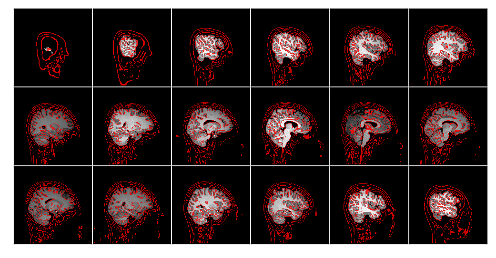
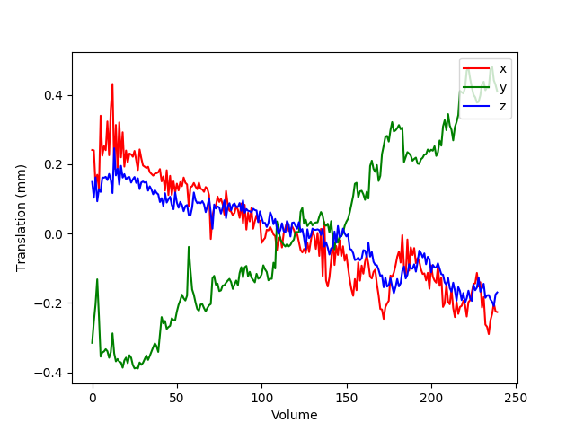

*******************
Functional Pipeline
*******************

.. contents:: Table of Contents

Here we discuss the CPAC implementation of the m2g-f pipeline.

Output Summary Table
====================

.. list-table:: ``m2g-f`` **IO Breakdown**. Below, we look at the inputs, outputs, and QA figures produced by ``m2g-f``. See `Pipeline Outputs`_ for more detailed file structure.
    :widths: 10 15 10 5
    :header-rows: 1
    :stub-columns: 0

    * - Step
      - Inputs
      - Outputs
      - QA figures
    * - Preprocessing
      - raw fMRI, raw T1w
      - preprocessed fMRI
      - Figure S2
    * - Registration
      - preprocessed fMRI, preprocessed T1w, template
      - aligned fMRI
      -
    * - Nuisance Correction
      - aligned fMRI
      - corrected fMRI
      - Figure S3
    * - Graph Generation
      - corrected fMRI, parcellations
      - connectome
      -

Pipeline Summary
==============================

.. figure:: ./_static/m2g_pipeline.png
    :align: left
    :figwidth: 700px

    Figure 1: The ``m2g-f`` organizes the data for processing by CPAC’s functional pipeline that we developed here. The ``m2g-f`` pipeline consists of 4 main steps: 1) preprocessing, 2) registration,  3) nuisance correction, and 4) graph generation. Each of these sections leverages publicely available tools and data to robustly produce the desired derivative of each step. Alongside derivative production, ``m2g-f`` produces QA figures at each stage that enable qualitative evaluation of the pipeline's performance.

-------------
Preprocessing
-------------

The ``m2g-f`` pipeline in CPAC uses AFNI's SkullStripping function with a variable shrink factor between 0.4 and 0.6 over 250 iterations with nearest neighbor interpolation to eliminate all non-neuronal structures from the anatomical image. The resulting anatomical file is resampled to the desired resolution voxel size using FSL's FNIRT. Slice timing correction is then performed using AFNI's 3dTshift, utilizing the TR value and scan acquisition method provided by the user. The resulting image is then motion corrected using AFNI's 3dvolreg, aligning all images to the first image in the functional MRI's timeseries.

Finally, ``m2g`` produces a QA plot showing the stripped image overlayed with the removed skull (Figure S2).

    Figure S2: ``m2g-f`` **Preprocessing QA**. ``m2g-f`` produces QA plot showing the stripped image overlayed with the removed skull.

-----------------
Registration
-----------------

Nonlinear boundary based registration of the preprocessed fMRI and anatomical images are performed in order to transform them into MNI152 space. The MNI152 6th generation anatomical reference image  is used in this registration process, as it is FSL's preferred image. The functional image is then registered to the anatomical scan using FSL ``bet`` with BBR. FSL's standard white matter, grey matter, and cerebral spinal fluid masks are then registered onto the functional image using FSL's ``FAST`` thresholding, resulting in segmentation tissue masks. The specified atlases that are going to be used in the connectome generation are also registered to the functional space using FSL's ``FLIRT ``function.

-------------------
Nuisance Correction
-------------------

Nuisance correction of the functional image is performed using the component based noise correction (``CompCor``) method. Using ''noise ROIs'', or areas of white matter and cerebral spinal fluid whose intensity values are unlikely to be modulated by neural activity, physiological noise can be isolated.Based on this assumption, physiological noise in gray matter regions can be corrected for by regressing out principal components from noise ROIs. CompCor uses the previously registered white matter and cerebral spinal fluid masks (csf) in order to determine noise ROIs. A principal component analysis is applied using the top five components of the white matter and csf to characterize the times series data from the noise ROIs. Significant principal components are then introduced as covariates in a general linear model as an estimate for the physiological noise single space. Polynomial Detrending is also performed to remove linear or quadratic trends in the timeseries, likely from changes in scanner heat or subject movement. After nuisance regression, frequency filtering occurs on the functional data using a bandpass filter from 0.01 Hz to 0.1 Hz to account for low-frequency drift and high-frequency noise.

Finally, ``m2g`` produces a QA plot showing the plots for translation and rotation correction of the functional images (Figure S3).

    Figure S3: ``m2g-f`` **Nuisance Correction QA**. ``m2g-f`` produces QA showing movement translational plot for translation correction of functional image.

-----------------
Graph Estimation
-----------------

With the anatomical files and atlases registered to the functional image, the estimation of the functional connectomes for each atlas can occur. For each ROI, the timeseries of the average of all voxels within the ROI at each collection time point is calculated. This timeseries is then used to calculate the Pearson's correlation coefficient  between each pair of ROIs. The functional connectome is then rank-transformed by replacing the magnitude of the correlation with its relative rank, from smallest to largest. The resulting adjacency matrix of correlations is then saved, along with an edgelist file containing the same information.

Pipeline Outputs
================

The organization of the output files generated by the m2g-f pipeline are shown below. If you only care about the connectome edgelists (``m2g``'s fundamental output), you can find them in `/output/connectomes_f`. File labels that may appear on output files, these denote additional actions m2g may have done:

#. ``RAS`` = File was originally in RAS orientation, so no reorientation was necessary
#. ``reor_RAS`` = File has been reoriented into RAS+ orientation
#. ``nores`` = File originally had the desired voxel size specified by the user (default 2mmx2mmx2mm), resulting in no reslicing
#. ``res`` = The file has been resliced to the desired voxel size specified by the user

.. code-block::

    /output
        /anat_f
            /anatomical_brain
                <subject>_<session>_T1w_resample_calc.nii.gz = resampled and skullstripped brain from anatomical image
            /anatomical_brain_mask
                <subject>_<session>_T1w_resample_skullstrip_calc.nii.gz = mask of resampled and skullstripped brain from anatomical image
            /anatomical_csf_mask
                segment_seg_0_maths_maths.nii.gz = mask of csf area of anatomical image
            /anatomical_gm_mask
                segment_seg_1_maths_maths.nii.gz = mask of grey matter area of anatomical image
            /anatomical_reorient
                <subject>_<session>_T1w_resample.nii.gz = reorientated and resampled anatomical image
            /anatomical_to_mni_nonlinear_xfm
                <subject>_<session>_T1w_resample_fieldwarp.nii.gz = fieldwarp for registering the anatomical image to MNI space
            /anatomical_to_standard
                <subject>_<session>_T1w_resample_calc_warp.nii.gz = anatomical image registered to MNI space
            /anatomical_wm_mask
                segment_seg_2_maths_maths.nii.gz = mask of white matter area of anatomical image
            /seg_mixeltype
                segment_mixeltype.nii.gz = mixeltype representation of anatomical image
            /seg_partial_volume_files
                segment_pve_0.nii.gz = mask of grey matter regions of anatomical image
                segment_pve_1.nii.gz = mask of grey matter/white matter boundary of anatomical image
                segment_pve_2.nii.gz = mask of white matter regions of anatomical image
            /seg_partial_volume_map
                segment_pveseg.nii.gz = partial volume map of anatomical image
            /seg_probability_maps
                segment_prob_0.nii.gz = probability map of anatomical image for grey matter
                segment_prob_1.nii.gz = probability map of grey/white matter boundary
                segment_prob_2.nii.gz = probability map of anatomical image for white matter
        /connectomes_f
            /<atlas>
                _<ses>_func_<atlas>_abs_edgelist.csv = edgelist file for estimated connectome where the absolute value of the correlation is given
                _<ses>_func_<atlas>_edgelist.csv = edgelist file for estimated connectome
        /func
            /preproc
                /coordinate_transformation
                    <subject>_<session>_task-rest_bold_calc_tshift_resample.aff12.1D =
                /frame_wise_displacement_jenkinson
                    FD_J.1D = vector containing Jenkinson measurement of framewise displacement for each frame of the functional image file
                /frame_wise_displacement_power
                    FD.1D = vector containing power of framewise displacement for each frame of the functional image file
                /functional_brain_mask
                    <subject>_<session>_task-rest_bold_calc_tshift_resample_volreg_mask.nii.gz = brain mask for the functional image
                /functional_brain_mask_to_standard
                    <subject>_<session>_task-rest_bold_calc_tshift_rasample_volreg_mask_warp.nii.gz = functional brain mask registered to MNI152 space
                /functional_freq_filtered
                    bandpassed_demeaned_filtered.nii.gz = frequency filtered functional file
                /functional_nuisance_regressors
                    nuisance_regressors.1D
                /functional_nuisance_residuals
                    residuals.nii.gz
                /functional_preprocessed
                    <subject>_<session>_task-rest_bold_calc_tshift_resample_volreg_calc_maths.nii.gz = skullstripped brain from motion corrected functional image file resampled to voxel dimensions specified by user
                /functional_preprocessed_mask
                    <subject>_<session>_task-rest_bold_calc_tshift_resample_volreg_calc_maths_maths.nii.gz = mask for image contained in /functional_preprocessed
                /motion_correct
                    <subject>_<session>_task-rest_bold_calc_tshift_resample_volreg.nii.gz = motion corrected functional image file resampled to voxel dimensions specified by user
                /motion_correct_to_standard_smooth
                    /_fwhm_4
                        <subject>_<session>_task-rest_bold_calc_tshift_resample_volreg_warp_maths.nii.gz
                /motion_params
                    motion_parameters.txt = statistical measurements of motion correction performed on functional image
                /raw_functional
                    <subject>_<session>_task-rest_bold.nii.gz = unaltered input functional image
                /slice_time_corrected
                    <subject>_<session>_task-rest_bold_calc_tshift.nii.gz = slice time corrected functional image
            /register
                /functional_to_anat_linear_xfm
                    <subject>_<session>_task-rest_bold_calc_tshift_resample_volreg_calc_tstat_flirt.mat =
                /functional_to_standard
                    bandpassed_demeaned_filtered_warp.nii.gz = bandpassed and demeaned filtered warp map for registering the functional image to MNI space
                /max_displacement
                    max_displacement.1D
                /mean_functional
                    <subject>_<session>_task-rest_bold_calc_tshift_resample_volreg_calc_tstat.nii.gz = mean functional image from all volumes
                /mean_functional_in_anat
                    <subject>_<session>_task-rest_bold_calc_tshift_resample_volreg_calc_tstat_flirt.nii.gz = mean functional image registered to the anatomical image
                /mean_functional_to_standard
                    <subject>_<session>_task-rest_bold_calc_tshift_resample_volreg_calc_tstat_warp.nii.gz = mean functional image registered to MNI space
                /movement_parameters
                    <subject>_<session>_task-rest_bold_calc_tshift_resample.1D = movement parameters applied to each volumen of functional image
                /power_params
                    pow_params.txt = different measurements on the power of functional images
                /roi_timeseries
                    /<atlas>
                        roi_stats.csv = mean voxel intensity for each region of interest at each time point, used to calculate functional connectome
                        roi_stats.npz = pickeled version of roi_stats.csv

        /log_f
            callback.log = nipype log for modules made for pipeline
            cpac_data_config_<date>.yml = file containing functional and anatomical image directory location
            cpac_individual_timing_m2g.csv = record of the elapsed time from the run of m2g-f
            cpac_pipeline_config_<date>.yml = copy of CPAC configuration file
            functional_pipeline_settings.yaml = record of CPACP pipeline parameter settings
            pypeline.lock = intermediate file created for pipeline running
            pypeline.log = nipype log with record of everything printed to terminal
            subject_info_<subject>_<session>.pkl = pickle file of functional and anatomical file information

        /qa_f
            /carpet
                carpet_seg.png
            /csf_gm_wm_a
                montage_csf_gm_wm_a.png = axial view of mask of csf/grey matter/white matter regions overlaid on top of anatomical image
            /csf_gm_wm_s
                montage_csf_gm_wm_s.png = sagittal view of mask of csf/grey matter/white matter regions overlaid on top of anatomical image
            /mean_func_with_mni_edge_a
                MNI_edge_on_mean_func_mni_a.png = axial view of outline of MNI reference anatimical image overlaid on top of mean functional image
            /mean_func_with_mni_edge_s
                MNI_edge_on_mean_func_mni_s.png = sagittal view of outline of MNI reference anatimical image overlaid on top of mean functional image
            /mean_func_with_t1_edge_a
                t1_edge_on_mean_func_in_t1_a.png = axial view of outline of anatomical image overlaid on top of mean functional image registered to the anatomical image
            /mean_func_with_t1_edge_s
                t1_edge_on_mean_func_in_t1_s.png = sagittal view of outline of anatomical image overlaid on top of mean functional image registered to the anatomical image
            /mni_normalized_anatomical_a
                mni_anat_a.png = axial view of anatomical image registered to MNI image
            /mni_normalized_anatomical_s
                mni_anat_s.png = sagittal view of anatomical image registered to MNI image
            /movement_rot_plot
                motion_rot_plot.png = movement rotation plot for rotation correction of functional image
            /movement_trans_plot
                motion_trans_plot.png = movement translational plot for translation correction of functional image
            /skullstrip_vis_a
                skull_vis_a.png = axial view of original anatomical image overlaid on top of skullstripped anatomical image
            /skullstrip_vis_s
                skull_vis_s.png = sagittal view of original anatomical image overlaid on top of skullstripped anatomical imag
            /snr_a
                snr_a.png = axial view of signal to noise ratio for functional image
            /snr_hist
                snr_hist_plot.png = signal to noise ratio intensity plot
            /snr_s
                snr_s.png = sagittal view of signal to noise ratio for functional image
            /snr_val
                average_snr_file.txt = single value of average signal to noise ratio for functional image
